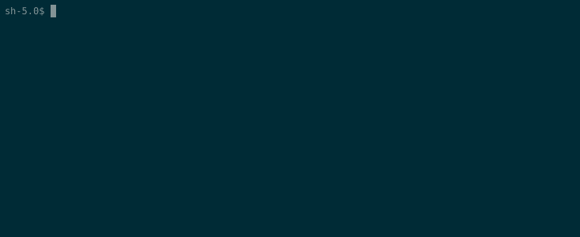

# STACKL

   
   
  ) 

**STACKL** is an open-source software platform that enables users to flexibly model, describe, and automate their application orchestration.
STACKL supports the autonomous configuration, coordination, and management of applications and IT infrastructure by:

* forming the Single Source of Truth (SSOT) configuration data lookup store for your IT environment including infrastructure resources, application definitions, and their characteristics and services
* decoupling configuration data, automation strategy, and deployment targets thereby simplifying the automated infrastructure management for code and configuration tooling
* providing pluggable modules for backend systems, such as processing and data storage, to support different scalability and performance requirements and enable users to choose their preferred tools

In essence, it allows you to model, describe, and automate your application orchestration workflow.

Users are saved from  manual work each time they want to deploy their projects by automating and simplifying IT infrastructure selection, application specification, and choosing suitable orchestration tools. Users now simply model their available infrastructure, describe their desired applications, and specify the desired orchestration tools once. STACKL then transparently and autonomously uses this information to correctly and efficiently orchestrate and automate applications in the available IT environment across their lifetime and managing dynamic changes.

## :rocket:Installation

This section includes a quick guide to what is required, how to install, and how to do a first test run.

### Prerequisites

* Kubernetes environment
* Helm 3
* Kubectl

### Installing

* Clone the Helm repository `git clone git@github.com:stacklio/stackl-helm.git`
* Create a namespace that will house the STACKL deployment `kubectl create namespace stackl`
* Execute the following command to deploy STACKL in the active K8s context: `helm install stackl -n stackl --generate-name`
* Execute the following command to deploy STACKL agent in the active K8s context: `helm install stackl -n stackl-agent --generate-name`

You can see all the pods with the following command: `watch kubectl get pods -n stackl`

## More info about STACKL

### Core goals

* Open-source and community-oriented
  * Based on coding best practices
  * Consistent use of standards and guidelines
  * Documented
* Adaptable, flexible, general-purpose, and extensible
  * Integrates with a variety of pluggable modules including custom and no critical technology dependencies
  * Focus on working with current known and popular tools and software
  * Internally/externally uniform and accessible by using universal standards and terminology
  * Driven by specifiable policies to enable flexible orchestration
* Scalable, lightweight, and performant
  * Distributable across infrastructure and easy to scale
  * Able to make trade-offs to match different quality-of-service requirements
* End-to-end support for microservices and infrastructure management in a DevOps workflow (interesting read: [What is DevOps?](https://www.atlassian.com/devops))

### Features

* STACKL works with YAML or JSON documents to allow  for easy Key/Value management and future-proof cross-system compatibility
* STACKL provides a REST API with a web interface
* Users supply Stack Application Templates (SATs), which model and describe the desired applications, and Stack Infrastructure Templates (SITs), which specify the IT infrastructure available for use for the application. SITs and SATs can be processed and matched according to specified policies and result in a Stack Template, a Key/Value document that describes the desired state of an application on the infrastructure and can be deployed in the users IT environment by orchestration tools
* STACKL supports pluggable modules to allow users to use their desired technological backends. For instance, the used datastore and task processing solutions can be specified by the user
* STACKL is engineered to allow easy extensions for new technological backends through providing interfaces that enable transparent interaction
* Entities, i.e., workers, automation platforms, agents, … ,  are fully decoupled and can be distributed to improve fault-tolerance and scalability.
* The deployment and use of STACKL works with popular DevOps technologies and platforms: Docker, Kubernetes, Ansible, Azure, AWS, and is oriented towards the future, for instance, for serverless computing (FaaS/SaaS).
* Autonomous operation is a key focus: as much as possible, after deployment of STACKL, the system and its entities will self-manage and self-discover
* To allow rapid use of STACKL, it provides a minimal and fast setup on a regular computer for a normal user. Button-press fire-and-forget deployment of STACKL enables users to take it for a quick spin.

### Even more information

* See [stackl.io](https://www.stackl.io) to get started with documentation and tutorials.
* See [STACKL slides](https://drive.google.com/open?id=10ZmqGU3pOc6EJyZpED4fMgav5pD01RztLkfSn3Jl9EA) for a short presentation about STACKL.

## Contributing

Contributions, issues, and feature requests are always more than welcome! Feel free to check [issues page](https://github.com/stacklio/stackl/issues) if you want to contribute.

STACKL is programmed mainly in Python 3 and meant to follow best-practice coding guidelines.
As a point-of-reference, we use the [Google Python Style Guide](https://google.github.io/styleguide/pyguide.html) for coding and the [Google developer documentation style guide](https://developers.google.com/style) for documentation.

See [CONTRIBUTING](CONTRIBUTING.md) to get started.
Please also read the [CODE_OF_CONDUCT](CODE_OF_CONDUCT.md).

For a list of changes, see [Changelog](CHANGELOG.md).
For the releases, see [Github Releases](https://github.com/stacklio/stackl/releases).

## Security

### Reporting Security Vulnerabilities

Please report vulnerabilities by email to [stackl-security](mailto:stackl-security@stackl.io).
We will send a confirmation message to acknowledge that we have received the report and we will inform you once the issue has been investigated.

## License

The code in this project is licensed under the [GLPv3](LICENSE) license.

## Acknowledgments

STACKL was initially created for in-house use by [Nubera](https://www.nubera.eu/), a DevOps consultancy company who saw the need for a platform to better provide services to clients. After some time, it became clear that STACKL could be useful to the general DevOps community as well so the decision was made to spin it off as an open source project.
Hence, thanks to [Nubera](https://www.nubera.eu/)  and [Yannick Struyf](https://github.com/yannickstruyf3) who put in much of the hard initial work.
